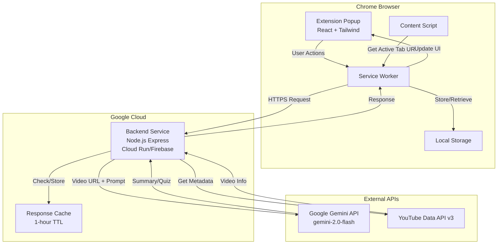
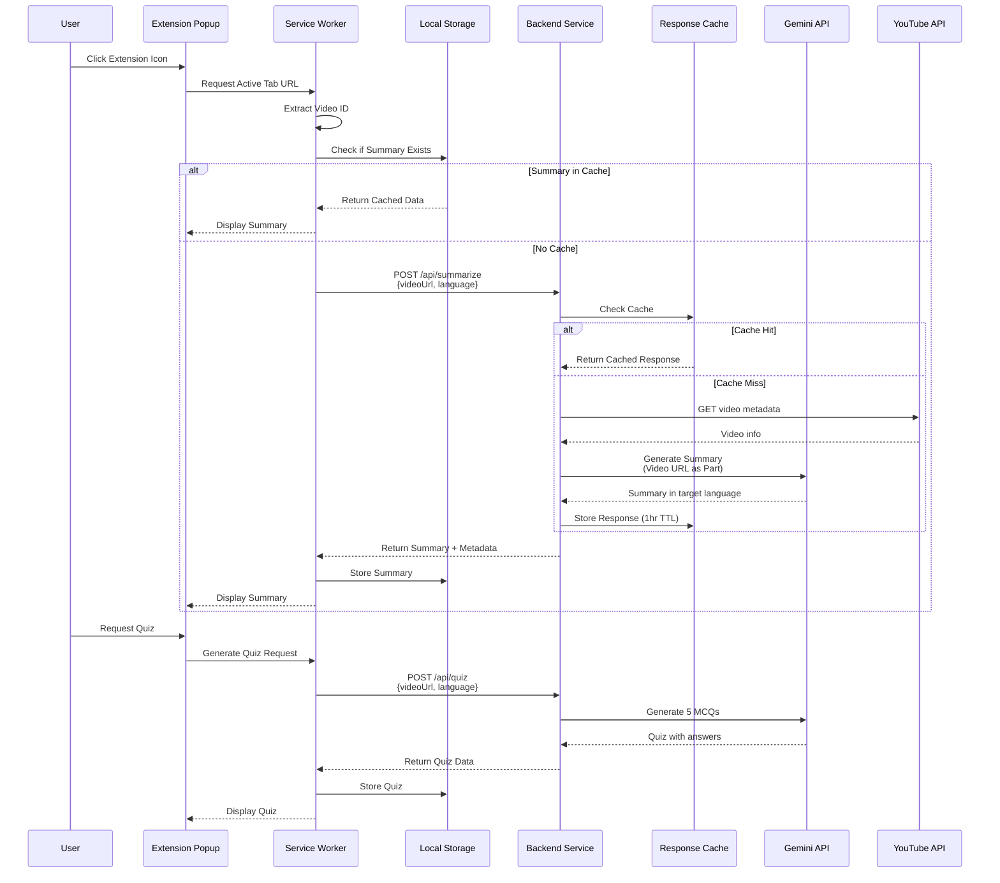

# Design Document: AI Note Taker Chrome Extension

## Overview

The AI Note Taker is a Chrome extension (Manifest V3) that provides intelligent video summarization and quiz generation for YouTube content with first-class support for Indic languages. The system follows a three-tier architecture: a React-based Chrome extension frontend, a Node.js Express backend service, and integration with Google Gemini API for AI processing.

The design prioritizes simplicity, performance, and accessibility for users across India by supporting 10+ Indic languages and providing an intuitive interface for educational content consumption.

### Key Design Principles

1. **Indic-First**: Default to Hindi and provide seamless support for major Indian languages
2. **Offline-Capable**: Cache summaries and quizzes locally for offline access
3. **Performance**: Minimize API calls through intelligent caching and local storage
4. **Security**: Keep API keys server-side, validate all inputs, implement CORS properly
5. **User Experience**: Provide clear feedback, loading states, and error messages

## Architecture

### High-Level Architecture



### Component Interaction Flow



## Data Models

### TypeScript Interfaces

```typescript
// Request/Response Models

interface GeminiSummaryRequest {
  videoUrl: string;
  language: SupportedLanguage;
  videoId: string;
  requestType: 'summary' | 'quiz';
}

interface GeminiSummaryResponse {
  success: boolean;
  data?: {
    videoId: string;
    videoTitle: string;
    channelName: string;
    duration: string;
    summary: string;
    language: SupportedLanguage;
    timestamp: number;
  };
  error?: {
    code: string;
    message: string;
  };
}

interface QuizSchema {
  videoId: string;
  questions: QuizQuestion[];
  language: SupportedLanguage;
  timestamp: number;
}

interface QuizQuestion {
  id: number;
  question: string;
  options: string[]; // Array of 4 options
  correctAnswer: number; // Index of correct option (0-3)
  explanation: string;
}

interface UserPreferences {
  language: SupportedLanguage;
  theme: 'light' | 'dark';
  autoGenerateSummary: boolean;
  quizMode: 'sequential' | 'all-at-once';
}

interface HistoryEntry {
  videoId: string;
  videoUrl: string;
  videoTitle: string;
  channelName: string;
  summary: string;
  quiz?: QuizSchema;
  language: SupportedLanguage;
  timestamp: number;
}

interface LocalStorageSchema {
  preferences: UserPreferences;
  history: HistoryEntry[];
  version: string;
}

type SupportedLanguage = 
  | 'en' // English
  | 'hi' // Hindi
  | 'ta' // Tamil
  | 'mr' // Marathi
  | 'te' // Telugu
  | 'bn' // Bengali
  | 'gu' // Gujarati
  | 'kn' // Kannada
  | 'ml' // Malayalam
  | 'pa' // Punjabi
  | 'or'; // Odia

// YouTube API Models

interface YouTubeVideoMetadata {
  videoId: string;
  title: string;
  channelName: string;
  duration: string; // ISO 8601 format
  thumbnailUrl: string;
  publishedAt: string;
}

// Gemini API Integration Models

interface GeminiVideoRequest {
  contents: [
    {
      parts: [
        {
          fileData: {
            mimeType: 'video/*';
            fileUri: string; // YouTube URL
          };
        },
        {
          text: string; // Prompt for summary/quiz
        }
      ];
    }
  ];
  generationConfig: {
    temperature: number;
    maxOutputTokens: number;
  };
}

interface GeminiResponse {
  candidates: [
    {
      content: {
        parts: [
          {
            text: string;
          }
        ];
      };
      finishReason: string;
    }
  ];
}
```

## Component Design

### Chrome Extension Components

#### 1. Extension Popup (React)

**File**: `src/popup/Popup.tsx`

**Responsibilities**:
- Display video information and summaries
- Provide language selection dropdown
- Show quiz interface
- Display history list
- Theme toggle control

**Key Features**:
- Responsive layout using Tailwind CSS
- Loading states with skeleton screens
- Error boundary for graceful error handling
- Accessibility compliance (ARIA labels, keyboard navigation)

**State Management**:
```typescript
interface PopupState {
  currentVideo: YouTubeVideoMetadata | null;
  summary: string | null;
  quiz: QuizSchema | null;
  isLoading: boolean;
  error: string | null;
  selectedLanguage: SupportedLanguage;
  theme: 'light' | 'dark';
  activeTab: 'summary' | 'quiz' | 'history';
}
```

#### 2. Service Worker (Background Script)

**File**: `src/background/service-worker.ts`

**Responsibilities**:
- Listen for extension icon clicks
- Capture active tab URL
- Communicate with backend API
- Manage local storage operations
- Handle message passing between popup and content scripts

**Key Functions**:
```typescript
async function getActiveTabUrl(): Promise<string>;
async function extractVideoId(url: string): Promise<string | null>;
async function fetchSummary(request: GeminiSummaryRequest): Promise<GeminiSummaryResponse>;
async function fetchQuiz(videoId: string, language: SupportedLanguage): Promise<QuizSchema>;
async function saveToHistory(entry: HistoryEntry): Promise<void>;
async function loadHistory(): Promise<HistoryEntry[]>;
```

#### 3. Content Script (Optional)

**File**: `src/content/content-script.ts`

**Responsibilities**:
- Inject UI elements into YouTube pages (future enhancement)
- Monitor video playback state
- Extract video metadata from DOM

**Note**: For MVP, content script is optional. Service worker can handle URL extraction.

### Backend Service Components

#### 1. Express Server

**File**: `backend/src/server.ts`

**Endpoints**:

```typescript
// POST /api/summarize
// Request body: { videoUrl: string, language: SupportedLanguage }
// Response: GeminiSummaryResponse

// POST /api/quiz
// Request body: { videoUrl: string, language: SupportedLanguage }
// Response: QuizSchema

// GET /api/health
// Response: { status: 'ok', timestamp: number }
```

**Middleware**:
- CORS configuration for Chrome extension origin
- Request validation
- Rate limiting (10 requests per minute per IP)
- Error handling
- Request logging

#### 2. Gemini API Service

**File**: `backend/src/services/gemini.service.ts`

**Key Functions**:

```typescript
class GeminiService {
  async generateSummary(
    videoUrl: string, 
    language: SupportedLanguage
  ): Promise<string>;
  
  async generateQuiz(
    videoUrl: string, 
    language: SupportedLanguage
  ): Promise<QuizQuestion[]>;
  
  private buildPrompt(
    type: 'summary' | 'quiz', 
    language: SupportedLanguage
  ): string;
  
  private parseGeminiResponse(response: GeminiResponse): string;
}
```

**Prompt Templates**:

```typescript
const SUMMARY_PROMPT = {
  en: "Provide a comprehensive summary of this video in English. Include key points, main topics, and important takeaways.",
  hi: "इस वीडियो का विस्तृत सारांश हिंदी में प्रदान करें। मुख्य बिंदु, प्रमुख विषय और महत्वपूर्ण निष्कर्ष शामिल करें।",
  // ... other languages
};

const QUIZ_PROMPT = {
  en: "Generate exactly 5 multiple-choice questions based on this video content. For each question, provide 4 options with one correct answer and a brief explanation. Format as JSON.",
  hi: "इस वीडियो की सामग्री के आधार पर ठीक 5 बहुविकल्पीय प्रश्न बनाएं। प्रत्येक प्रश्न के लिए, एक सही उत्तर और संक्षिप्त स्पष्टीकरण के साथ 4 विकल्प प्रदान करें। JSON के रूप में प्रारूपित करें।",
  // ... other languages
};
```

#### 3. YouTube API Service

**File**: `backend/src/services/youtube.service.ts`

**Key Functions**:

```typescript
class YouTubeService {
  async getVideoMetadata(videoId: string): Promise<YouTubeVideoMetadata>;
  
  private parseIsoDuration(duration: string): string;
}
```

#### 4. Cache Service

**File**: `backend/src/services/cache.service.ts`

**Implementation**: In-memory cache with TTL (Time To Live)

```typescript
class CacheService {
  private cache: Map<string, { data: any; expiry: number }>;
  
  set(key: string, value: any, ttlSeconds: number): void;
  get(key: string): any | null;
  delete(key: string): void;
  clear(): void;
}
```

**Cache Strategy**:
- Cache key: `${videoId}_${language}_${type}`
- TTL: 1 hour (3600 seconds)
- Max cache size: 100 entries (LRU eviction)

## File Structure

```
ai-note-taker/
├── manifest.json                 # Manifest V3 configuration
├── package.json
├── tsconfig.json
├── tailwind.config.js
├── webpack.config.js
│
├── src/
│   ├── popup/
│   │   ├── Popup.tsx            # Main popup component
│   │   ├── components/
│   │   │   ├── SummaryView.tsx
│   │   │   ├── QuizView.tsx
│   │   │   ├── HistoryView.tsx
│   │   │   ├── LanguageSelector.tsx
│   │   │   ├── ThemeToggle.tsx
│   │   │   └── LoadingSpinner.tsx
│   │   ├── hooks/
│   │   │   ├── useLocalStorage.ts
│   │   │   ├── useTheme.ts
│   │   │   └── useVideoData.ts
│   │   ├── styles/
│   │   │   └── popup.css
│   │   └── index.tsx
│   │
│   ├── background/
│   │   ├── service-worker.ts    # Background service worker
│   │   ├── api-client.ts        # Backend API communication
│   │   └── storage-manager.ts   # Local storage operations
│   │
│   ├── content/
│   │   └── content-script.ts    # Optional content script
│   │
│   ├── shared/
│   │   ├── types.ts             # Shared TypeScript interfaces
│   │   ├── constants.ts         # App constants
│   │   └── utils.ts             # Utility functions
│   │
│   └── assets/
│       ├── icons/
│       │   ├── icon16.png
│       │   ├── icon48.png
│       │   └── icon128.png
│       └── images/
│
├── backend/
│   ├── package.json
│   ├── tsconfig.json
│   ├── .env.example
│   │
│   ├── src/
│   │   ├── server.ts            # Express server setup
│   │   ├── routes/
│   │   │   └── api.routes.ts
│   │   ├── controllers/
│   │   │   ├── summary.controller.ts
│   │   │   └── quiz.controller.ts
│   │   ├── services/
│   │   │   ├── gemini.service.ts
│   │   │   ├── youtube.service.ts
│   │   │   └── cache.service.ts
│   │   ├── middleware/
│   │   │   ├── cors.middleware.ts
│   │   │   ├── validation.middleware.ts
│   │   │   ├── rate-limit.middleware.ts
│   │   │   └── error-handler.middleware.ts
│   │   ├── types/
│   │   │   └── index.ts
│   │   └── utils/
│   │       ├── logger.ts
│   │       └── validators.ts
│   │
│   └── Dockerfile               # For Cloud Run deployment
│
├── docs/
│   ├── API.md                   # API documentation
│   ├── DEPLOYMENT.md            # Deployment guide
│   └── ARCHITECTURE.md          # Architecture details
│
└── tests/
    ├── unit/
    ├── integration/
    └── e2e/
```

## Manifest V3 Configuration

**File**: `manifest.json`

```json
{
  "manifest_version": 3,
  "name": "AI Note Taker",
  "version": "1.0.0",
  "description": "Summarize YouTube videos and generate quizzes in Indic languages using Google Gemini AI",
  "permissions": [
    "activeTab",
    "storage",
    "tabs"
  ],
  "host_permissions": [
    "https://www.youtube.com/*",
    "https://youtu.be/*"
  ],
  "background": {
    "service_worker": "background/service-worker.js",
    "type": "module"
  },
  "action": {
    "default_popup": "popup/index.html",
    "default_icon": {
      "16": "assets/icons/icon16.png",
      "48": "assets/icons/icon48.png",
      "128": "assets/icons/icon128.png"
    }
  },
  "icons": {
    "16": "assets/icons/icon16.png",
    "48": "assets/icons/icon48.png",
    "128": "assets/icons/icon128.png"
  },
  "content_security_policy": {
    "extension_pages": "script-src 'self'; object-src 'self'"
  }
}
```

## API Integration Details

### Gemini API Integration

To process YouTube content, the system utilizes the Google AI File API alongside the Gemini 2.0 Flash model. This ensures the model can "watch" the video to provide accurate multimodal summaries and quizzes.

## Workflow:

1. **Extraction**: Backend uses ytdl-core or yt-dlp to extract the audio/video stream from the YouTube URL.
2. **Upload**: The file is uploaded to the Gemini File API (https://generativelanguage.googleapis.com/upload/v1beta/files).
3. **Processing**: Once the file state is ACTIVE, a prompt is sent to generateContent.
4. **Cleanup**: Files are deleted from the File API after processing to maintain privacy and stay within storage quotas.

**Request Format**:

```typescript
const geminiRequest = {
  contents: [
    {
      role: "user",
      parts: [
        {
          fileData: {
            mimeType: "video/mp4",
            fileUri: "https://generativelanguage.googleapis.com/v1beta/files/FILE_ID"
          }
        },
        {
          text: "System Instruction: You are an Indic-language educational assistant. 
                 Output a structured summary and 5 MCQs in JSON format for the language: [LANGUAGE]."
        }
      ]
    }
  ],
  generationConfig: {
    temperature: 0.2, // Lower temperature for more factual summaries and consistent JSON
    responseMimeType: "application/json",
    maxOutputTokens: 2048
  },
  safetySettings: [
    {
      category: "HARM_CATEGORY_HARASSMENT",
      threshold: "BLOCK_MEDIUM_AND_ABOVE"
    }
  ]
};
```

**Key Features**:
- Direct YouTube URL support (no need to download video)
- Video understanding capability
- Multi-language output support
- Structured output for quiz generation

**Error Handling**:
- 400: Invalid request format
- 401: Invalid API key
- 403: Quota exceeded
- 429: Rate limit exceeded
- 500: Internal server error

### YouTube Data API Integration

**Endpoint**: `https://www.googleapis.com/youtube/v3/videos`

**Parameters**:
- `id`: Video ID
- `part`: snippet,contentDetails
- `key`: API Key

**Response Fields Used**:
- `snippet.title`: Video title
- `snippet.channelTitle`: Channel name
- `contentDetails.duration`: Video duration (ISO 8601)
- `snippet.thumbnails.default.url`: Thumbnail URL

## Security Considerations

### API Key Management

1. **Backend**: Store API keys in environment variables
   ```bash
   GEMINI_API_KEY=your_gemini_api_key
   YOUTUBE_API_KEY=your_youtube_api_key
   ```

2. **Never expose API keys in extension code**

3. **Use Cloud Secret Manager** for production deployments

### CORS Configuration

```typescript
const corsOptions = {
  origin: [
    'chrome-extension://YOUR_EXTENSION_ID'
  ],
  methods: ['GET', 'POST'],
  allowedHeaders: ['Content-Type'],
  credentials: false
};
```

### Input Validation

1. **URL Validation**: Verify YouTube URL format
2. **Language Validation**: Check against supported languages list
3. **Rate Limiting**: Prevent abuse with rate limits
4. **Request Size Limits**: Max 1KB request body

### Content Security Policy

- No inline scripts in extension
- Only load resources from extension package
- No eval() or Function() constructors

## Performance Optimization

### Extension Performance

1. **Code Splitting**: Lazy load quiz and history components
2. **Bundle Size**: Target < 500KB total bundle size
3. **Render Optimization**: Use React.memo for expensive components
4. **Storage Optimization**: Compress history entries if needed

### Backend Performance

1. **Response Caching**: 1-hour TTL for identical requests
2. **Connection Pooling**: Reuse HTTP connections to APIs
3. **Async Processing**: Non-blocking I/O operations
4. **Timeout Handling**: 60-second max request timeout

### API Optimization

1. **Batch Requests**: Combine metadata and summary requests when possible
2. **Conditional Requests**: Use ETags for YouTube API
3. **Quota Management**: Monitor and alert on quota usage
4. **Fallback Strategies**: Graceful degradation if APIs fail

## Error Handling Strategy

### Extension Error Handling

```typescript
enum ErrorCode {
  NO_YOUTUBE_VIDEO = 'NO_YOUTUBE_VIDEO',
  NETWORK_ERROR = 'NETWORK_ERROR',
  API_ERROR = 'API_ERROR',
  STORAGE_ERROR = 'STORAGE_ERROR',
  INVALID_RESPONSE = 'INVALID_RESPONSE'
}

interface AppError {
  code: ErrorCode;
  message: string;
  userMessage: string; // Localized message
  retryable: boolean;
}
```

### Backend Error Handling

```typescript
class ApiError extends Error {
  constructor(
    public statusCode: number,
    public code: string,
    message: string
  ) {
    super(message);
  }
}

// Error middleware
app.use((err: Error, req: Request, res: Response, next: NextFunction) => {
  if (err instanceof ApiError) {
    return res.status(err.statusCode).json({
      success: false,
      error: {
        code: err.code,
        message: err.message
      }
    });
  }
  
  // Unexpected errors
  console.error(err);
  res.status(500).json({
    success: false,
    error: {
      code: 'INTERNAL_ERROR',
      message: 'An unexpected error occurred'
    }
  });
});
```

## Testing Strategy

### Unit Tests

1. **Extension Components**: Test React components with Jest + React Testing Library
2. **Service Worker**: Test message passing and storage operations
3. **Backend Services**: Test Gemini and YouTube API integrations with mocks

### Integration Tests

1. **API Endpoints**: Test full request/response cycle
2. **Storage Operations**: Test local storage read/write
3. **Error Scenarios**: Test error handling paths

### E2E Tests

1. **User Flows**: Test complete user journeys with Playwright
2. **Cross-browser**: Test on Chrome, Edge, Brave
3. **Language Support**: Test all 11 supported languages

## Deployment

### Backend Deployment (Google Cloud Run)

```dockerfile
FROM node:18-alpine
WORKDIR /app
COPY package*.json ./
RUN npm ci --only=production
COPY . .
RUN npm run build
EXPOSE 8080
CMD ["node", "dist/server.js"]
```

**Cloud Run Configuration**:
- Min instances: 0 (scale to zero)
- Max instances: 10
- Memory: 512MB
- CPU: 1
- Timeout: 60s
- Concurrency: 80

### Extension Deployment

1. **Build**: `npm run build`
2. **Package**: Create ZIP of dist folder
3. **Upload**: Chrome Web Store Developer Dashboard
4. **Review**: Wait for Chrome Web Store review (1-3 days)

## Monitoring and Logging

### Backend Monitoring

1. **Cloud Logging**: Log all requests and errors
2. **Cloud Monitoring**: Track API latency, error rates
3. **Alerts**: Set up alerts for high error rates or quota limits

### Extension Monitoring

1. **Error Tracking**: Log errors to backend endpoint
2. **Usage Analytics**: Track feature usage (with user consent)
3. **Performance Metrics**: Monitor load times and API response times

## Future Enhancements

1. **Offline Mode**: Cache summaries for offline access
2. **Export Features**: Export summaries as PDF or Markdown
3. **Collaborative Notes**: Share summaries with others
4. **Voice Summaries**: Text-to-speech for summaries
5. **Timestamp Navigation**: Link summary points to video timestamps
6. **Custom Prompts**: Allow users to customize summary style
7. **Browser Support**: Extend to Firefox and Safari
8. **Mobile App**: Companion mobile application

## Compliance with AI for Bharat Guidelines

This design adheres to the AI for Bharat hackathon requirements:

1. **Indic Language Support**: First-class support for 10+ Indian languages
2. **Google AI Integration**: Uses Gemini 2.0 Flash API
3. **Educational Focus**: Provides learning tools (summaries and quizzes)
4. **Accessibility**: Supports users across India with varying language preferences
5. **Open Source Ready**: Architecture supports open-source release
6. **Scalability**: Cloud-native design for handling growth
7. **Documentation**: Comprehensive technical documentation

## Correctness Properties

### Property 1: URL Extraction Correctness
**Description**: For any valid YouTube URL, the system must correctly extract the video ID.

**Formal Property**:
```
∀ url ∈ ValidYouTubeURLs: extractVideoId(url) ≠ null ∧ isValidVideoId(extractVideoId(url))
```

**Test Strategy**: Property-based testing with generated YouTube URLs in various formats.

### Property 2: Language Preservation
**Description**: The output language must match the requested language.

**Formal Property**:
```
∀ request ∈ SummaryRequests: 
  language(generateSummary(request)) = request.language
```

**Test Strategy**: Generate summaries in all supported languages and verify output language.

### Property 3: Quiz Structure Validity
**Description**: Every generated quiz must have exactly 5 questions, each with 4 options and 1 correct answer.

**Formal Property**:
```
∀ quiz ∈ GeneratedQuizzes:
  |quiz.questions| = 5 ∧
  ∀ q ∈ quiz.questions: |q.options| = 4 ∧ q.correctAnswer ∈ [0,3]
```

**Test Strategy**: Property-based testing to verify quiz structure across multiple generations.

### Property 4: Storage Consistency
**Description**: Data stored in local storage must be retrievable and match the original data.

**Formal Property**:
```
∀ entry ∈ HistoryEntries:
  store(entry) → retrieve(entry.videoId) = entry
```

**Test Strategy**: Round-trip testing of storage operations.

### Property 5: Cache Correctness
**Description**: Cached responses must match fresh API responses for the same input.

**Formal Property**:
```
∀ request ∈ APIRequests:
  cache(request) = null → 
    (response = fetchFresh(request) ∧ cache(request) = response) ∧
  cache(request) ≠ null →
    cache(request) = fetchFresh(request)
```

**Test Strategy**: Compare cached and fresh responses for identical requests.

### Property 6: Error Recovery
**Description**: The system must handle all error conditions gracefully without crashing.

**Formal Property**:
```
∀ error ∈ PossibleErrors:
  handleError(error) → systemState = STABLE ∧ userNotified(error)
```

**Test Strategy**: Inject various error conditions and verify graceful handling.

## Conclusion

This design provides a comprehensive blueprint for building the AI Note Taker Chrome extension. The architecture prioritizes Indic language support, performance, security, and user experience while maintaining simplicity and maintainability. The modular design allows for incremental development and easy testing of individual components.

The system leverages Google Gemini's video understanding capabilities to provide intelligent summaries and quizzes, making educational content more accessible to users across India in their preferred languages.

